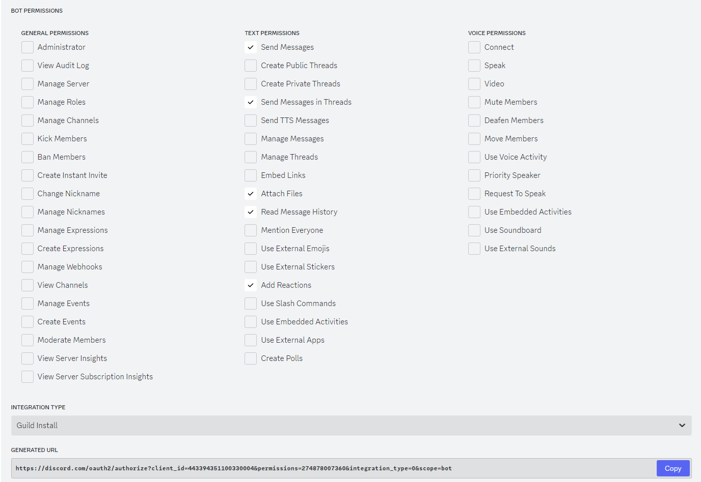

# README.md

画像を指定サイズ(VRChatで読み込めるサイズ)まで縮小してくれるDiscordBotです。

## 導入方法

性質上、自分専用Botにするのが好ましいため、各自でBot登録が必要です。
1. Botの作成・登録
   1. [Dicord Developer Portal](https://discord.com/developers/applications)を開く
   2. New Application ボタンから新規Botを作る
   3. Botの設定画面が開くので、Botタブに移動して以下の項目を確認する
      - `Build-A-Bot/TOKEN`: Reset Tokenボタンを押してアクセストークンを生成し、控えておく 
      ⚠️Botのパスワードに相当するものなので他人に教えないよう注意
      - `Privileged Gateway Intents/Message Content Intent`: 有効にする
   4. OAuth2タブに移動して、Botをサーバーへ登録するためのURLを生成する
      1. `SCOPES`の`bot`にチェック
      2. `Bot Permissions`が開くので、以下の項目に✅️
         - `Send Messages`
         - `Send Messages in Threads`
         - `Attach Files`
         - `Read Message History`
         - `Add Reactions`
      
      3. `Generated URL`に生成されたURLを開き、自分用のサーバーにBotを追加する
2. Botを実行する
   1. `config/config.json`をテキストエディタで開き、`token`欄に控えておいたアクセストークンを貼り付ける
   2. `Resotto.exe`を実行する
3. BotにDMで画像を送ると2048pxまで縮小される🕊️

## 使い方

Botが参加しているサーバー 
もしくはDMで解像度の大きい画像を貼ると、自動的に縮小した画像でリプライされます.

## config.jsonの項目

| 項目                        | 説明                                                                                                                             |
| --------------------------- | -------------------------------------------------------------------------------------------------------------------------------- |
| token                       | アクセストークン                                                                                                                 |
| presence                    | 「VRChatをプレイ中」みたいに表示されるBotのステータス                                                                            |
| target_resolution           | 変換先の解像度                                                                                                                   |
| max_file_count              | 複数の添付ファイルがある場合に何枚まで処理するか                                                                                 |
| log_level                   | ログレベル NOTSET / DEBUG / INFO / WARN / ERROR / FATAL                                                                      |
| quality                     | 5～0で縮小アルゴリズムを指定します 大きい方が高品質 5:Lanczos / 4:Bicubic / 3:Hamming / 2:Bilinear / 1:BoxFilter / 0:Nearest |
| use_timestamped_logfilename | ログファイルを実行毎に別名で保存するかどうか                                                                                     |

## コマンド

- `/enable_channel_whitelist`: サーバーでチャンネルホワイトリスト機能を有効化します. 特定のチャンネル以外での画像処理を行わないようにします
- `/disable_channel_whitelist`: サーバーでチャンネルホワイトリスト機能を無効化します
- `/add_resize_channel`: コマンドを実行したチャンネルをホワイトリストへ追加します
- `/remove_resize_channel`: コマンドを実行したチャンネルをホワイトリストから削除します
